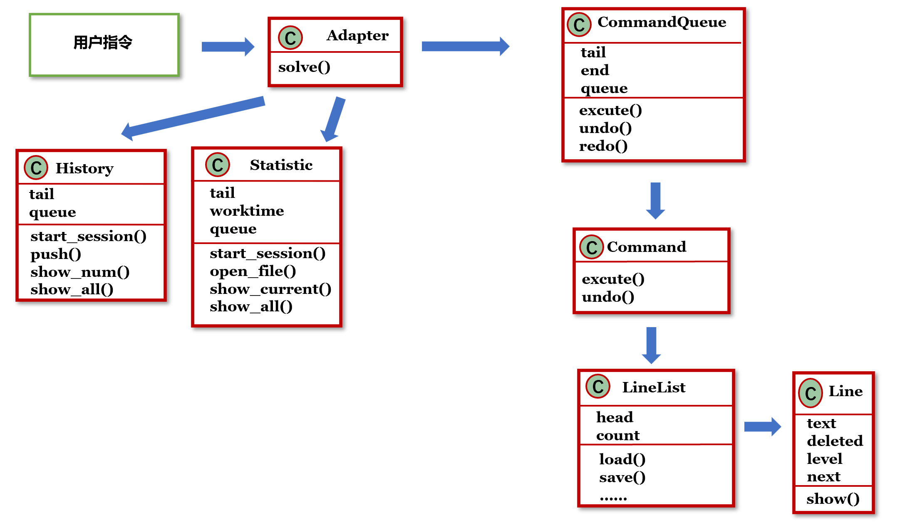
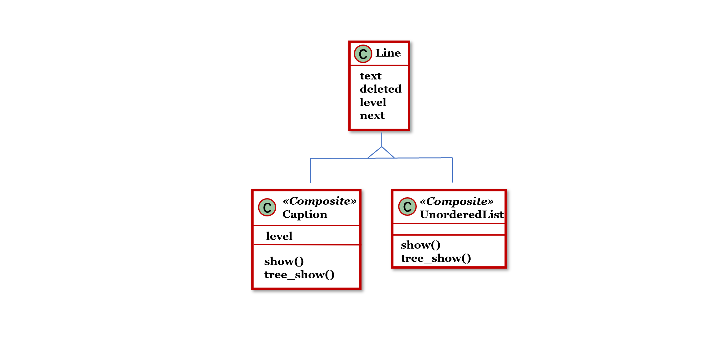
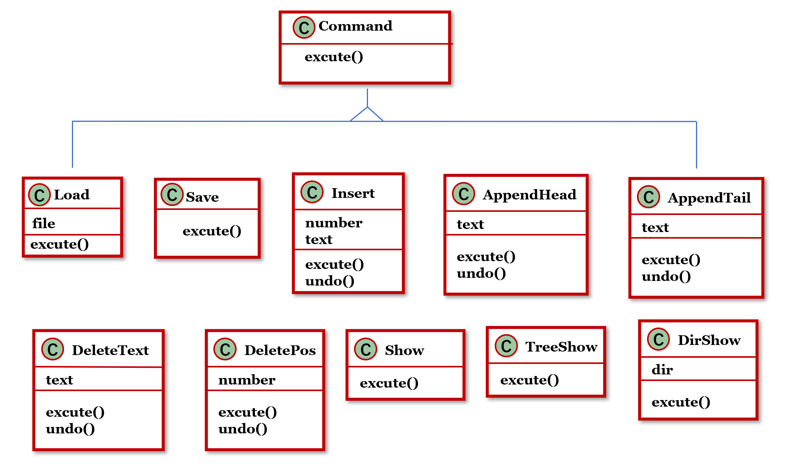
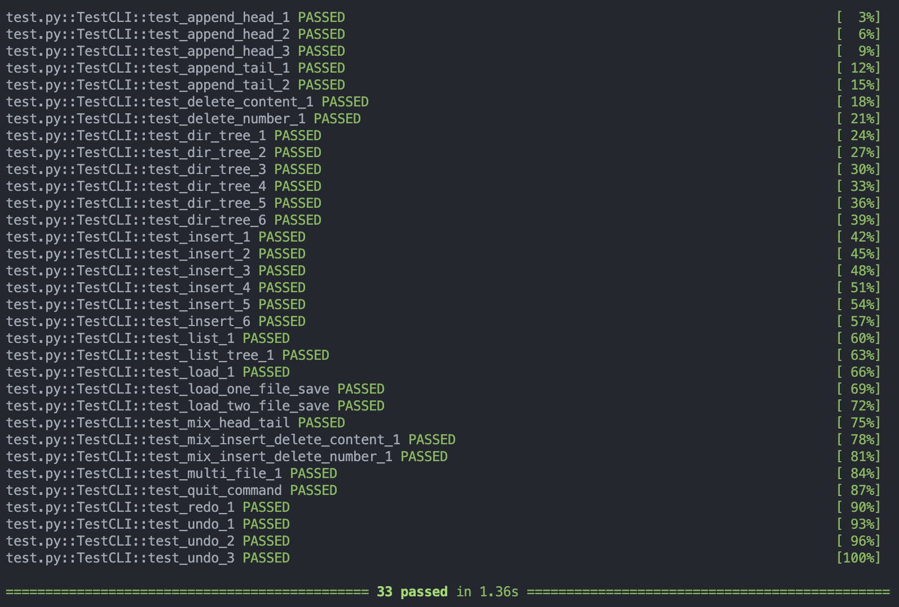
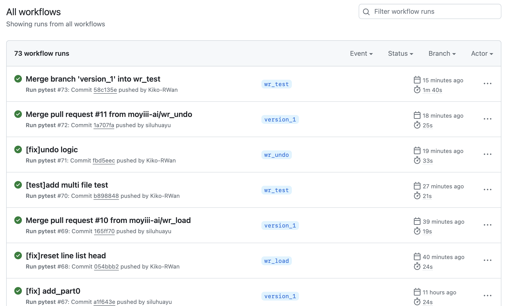
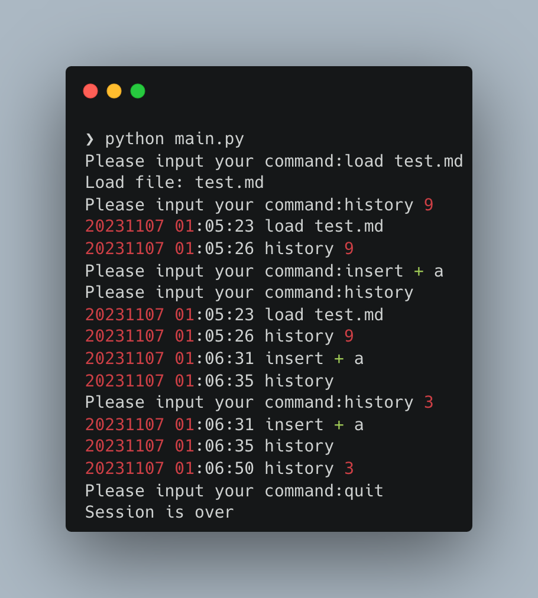
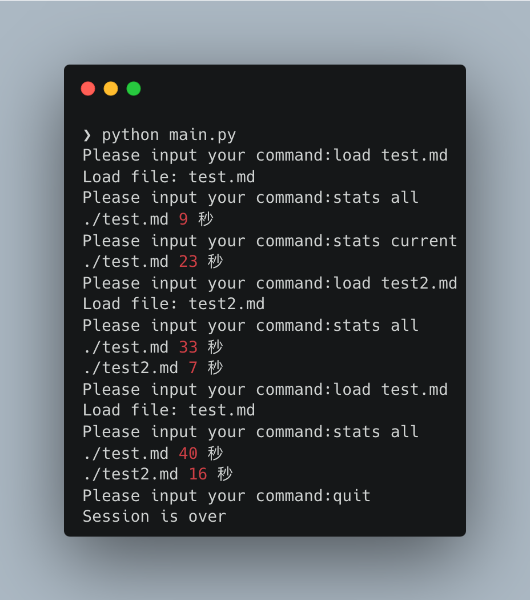

# 高级软件开发 小组Lab：简易Markdown编辑器

项目链接：https://github.com/moyiii-ai/Advanced-Software-Development

## 0. 运行方法

python版本：Python 3.9.6

在Advanced-Software-Development文件夹下运行命令：python main.py

## 1. 设计

1. 代码布局和变量命名参考[Google开源代码规范——Python风格指南](https://zh-google-styleguide.readthedocs.io/en/latest/google-python-styleguide/)：
   
   * 代码宽度不超过80。
   * 类和top-level函数定义之间空两行，类中的方法定义之间空一行，函数内逻辑无关段落之间空一行。
   * 类名使用Pascal命名法，函数和变量名使用小写字母和连字符。由于项目规模较小，且无全局常量，未区分全局变量和局部变量的命名。

2. 对于一条指令来说，workflow为：
   
   图1 workflow图，包含所有模块
   

3. 代码结构如下：
   
   * `main.py`
     
     Adapter：使用**Adapter模式**，将用户输入转化为可执行指令，分别递交CommandQueue、History或Statistic模块处理。
   
   * `log.py`
     
     History：负责日志载入、更新和显示。
     
     Statistic：负责统计数据初始化、更新和显示。
     
     以上两个模块与Command和Line这两个核心模块完全分离，只被Adapter引用。
   
   * `command.py`
     
     Command：一条指令。使用**Command模式**，每个子类对应一种类型的指令，各自实现excute和undo。
     
     CommandQueue：用队列来存储所有Command，以便进行undo和redo。
     
     图2：CommandQueue、Command和各Command子类，及其实现的函数
     
   
   * `line.py`
     
     Line：储存和编辑文件的基本单元，即一行。使用**Strategy模式**，每个子类对应一种类型的文件内容，各自实现show和dir_show。
     
     LineList：用链表来存储文件中的所有Line，通过python的装饰器实现**Singleton模式**。
     
     LineList中的tree_show和dir_show使用了**Composite模式**，以实现充分的代码复用。具体设计如下：
     
     * dir_show可以看作打印一个指定text对应的子树，因此在每个节点可以递归调用子节点。
     * 层次为inf的节点是叶子节点，在建立Line实例时保证这一点。
     * 如何通过链表了解树结构：从当前line向后，若当前节点层次为x，则紧随其后的层次大于x的非下降序列中节点都为它的儿子，遇到第一个层次不大于x的节点则子树结束。例如：line中节点层次分别为：1 2 inf 4 3 inf 3 3 2 1，则第一个2的子树包括 2 inf 4 3 inf 3 3，直接与它相连的儿子是 inf 4 3 3 3（第二个inf是第一个3的儿子）。
     * 整个文件可以看作由多个最高等级的标题构成的森林，因此tree_show的实现只需要对每个根节点调用dir_show。例如：line中节点层次分别为：inf inf 3 2 1 2 inf 3 inf 1 2，那么只需对inf inf 3 2 1 1调用dir_show即可，调用的节点层次构成一个非下降序列。
     
     图3：LineList、Line和各Line子类，及其实现的函数
     

## 2. 测试结果

本项目测试分两个部分，基本功能模块使用自动脚本测试，日志和统计模块使用手动测试。**需要注意的是**，本测试的目的在于尽量覆盖正常使用环境下的功能（较少考虑非法输入序列）

### 基本功能模块

此部分使用GitHub Action自动测试，测试脚本为`test.py`，包括33个测试用例，测试结果如下：

<center class="half">

</center>

### 日志和统计模块

此部分由于涉及时间操作，故使用手动测试，测试结果如下：

<center class="half">

</center>

## 3. 讨论

### 3.1 设计原则

1. CommandQueue只负责找出需要执行或撤销的指令，而不负责指令的具体执行过程，体现了**单一功能原则**。

2. 实现新的line类或command类即可支持新的文本类型和新操作，体现了**开闭原则**。

3. 每个line和command子类都提供了符合自己需求的特定构造函数，因此前置模块可以直接创建指定的子类实例，而不必传入冗余的参数，体现了**接口隔离原则**。

### 3.2 扩展

如何支持多个workspace：

目前，我们的程序会创建一个LineList实例，对应一个文件，它实际上就是workspace。

由于此前只能同时打开一个文件，我们对LineList使用了Singleton模式，所以现在只需取消Singleton限制，再为command指明操作的是哪个workspace即可，实际上这是同时存在多个workspace时所必需的。

我们将新建和切换workspace的逻辑放在Adapter中，处理load指令时新建workspace，switch函数用于将当前执行的指令切换到指定已存在的workspace。为此，Adapter需要增加一个列表，维护打开的workspace和它们的操作状态。

这样，Adapter处理后传递给CommandQueue的指令执行逻辑和原设计相同；CommandQueue模块仍然和LineList一一对应，以确保undo redo的正确性。

### 3.3 实现细节

1. 无序表和有序表都被视为叶子节点，不能再向下嵌套其他结构。

2. 有序表的index输入后就不能再改变，无论是否按顺序排列、后续是否有更改。

3. 由于delete等指令的特殊要求，默认输入中不存在完全相同的文本。

4. undo和redo的执行逻辑为：维护一个指令序列，有当前位置和队列末尾两个指针：
   
   * 当有新指令加入时，之前undo的所有指令都无法再redo，因此在当前位置插入指令，并把队列末尾设为当前位置；
   * undo时，不改变队列末尾，将当前位置前移，当前位置不为0也即有可撤销指令时才允许进行undo；
   * redo时，不改变队列末尾，将当前位置后移，当前位置在队列末尾之前，也即有已撤销指令时才允许进行redo。
   
   例如insert insert undo insert undo undo是一个合法的指令序列，最后所有的insert全部被undo。

5. dir_show的打印格式定义为：每层打印一个非上升子序列，作为本层的枝干，其子树保持相同规律。如上文中的例子：inf inf 3 2 1 2 inf 3 inf 1 2，打印效果如下（用层次表示文本内容）：
   
   ```
   ├── inf
   ├── inf
   ├── 3
   ├── 2
   └── 1
       └── 2
           ├── inf
           └── 3
               └── inf
   └── 1
       └── 2
   ```

6. 没有对CommandQueue和LineList使用Iterator模式，是由于对这两个结构的遍历方式基本不会发生改变，而使用Iterator模式还需要额外增加一个遍历专用的类，对已经较为复杂的设计来说负担过重。

## 4. 小组分工

结构设计，撰写文档，代码复核：徐怡然，孙若诗

代码实现：曹丝露，刘高志

编写测试脚本，测试用例：万瑞

文档复核，PPT制作和展示：顾轩
