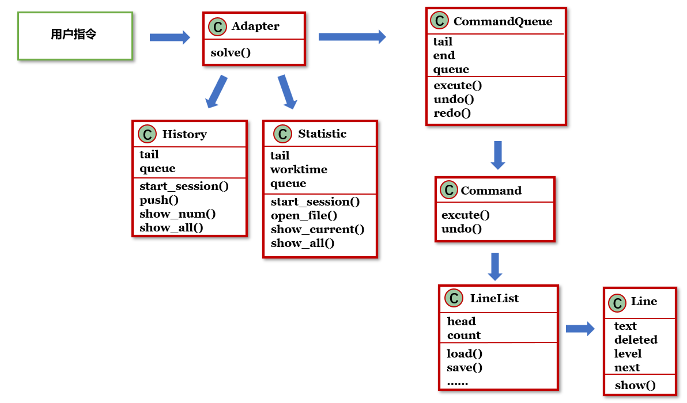
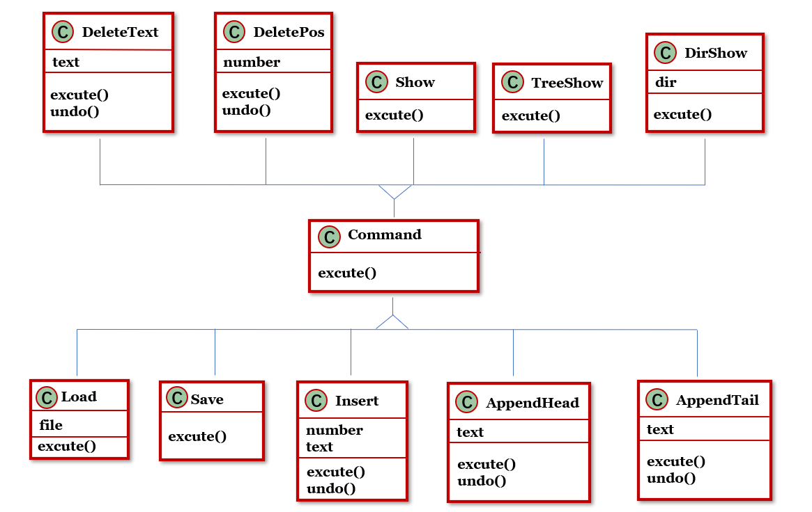
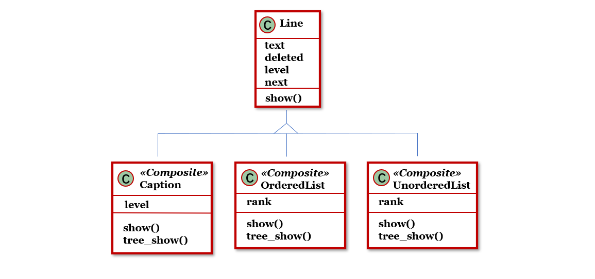

# 高级软件开发 小组Lab：简易Markdown编辑器

## 0. 运行方法


## 1. 设计

1. 代码布局和变量命名参考[Google开源代码规范——Python风格指南](https://zh-google-styleguide.readthedocs.io/en/latest/google-python-styleguide/)：

   * 代码宽度不超过80。
   * 类和top-level函数定义之间空两行，类中的方法定义之间空一行，函数内逻辑无关段落之间空一行。
   * 类名使用Pascal命名法，函数和变量名使用小写字母和连字符。由于项目规模较小，且无全局常量，未区分全局变量和局部变量的命名。

2. 对于一条指令来说，workflow为：

   图1 workflow图，包含所有模块
   

3. 代码结构如下：

   * `main.py`

     Adapter：使用**Adapter模式**，将用户输入转化为可执行指令，分别递交CommandQueue、History或Statistic模块处理。

   * `log.py`

     History：负责日志载入、更新和显示。

     Statistic：负责统计数据初始化、更新和显示。

     以上两个模块与Command和Line这两个核心模块完全分离，只被Adapter引用。

   * `command.py`

     Command：一条指令。使用**Command模式**，每个子类对应一种类型的指令，各自实现excute和undo。

     CommandQueue：用队列来存储所有Command，以便进行undo和redo。

     图2：CommandQueue、Command和各Command子类，及其实现的函数
     

   * `line.py`

     Line：储存和编辑文件的基本单元，即一行。使用**Strategy模式**，每个子类对应一种类型的文件内容，各自实现show和dir_show。

     LineList：用链表来存储文件中的所有Line，通过python的装饰器实现**Singleton模式**。

     LineList中的tree_show和dir_show使用了**Composite模式**，以实现充分的代码复用。具体设计如下：

     * dir_show可以看作打印一个指定text对应的子树，因此在每个节点可以递归调用子节点。
     * 层次为inf的节点是叶子节点，在建立Line实例时保证这一点。
     * 如何通过链表了解树结构：从当前line向后，若当前节点层次为x，则紧随其后的层次大于x的非下降序列中节点都为它的儿子，遇到第一个层次不大于x的节点则子树结束。例如：line中节点层次分别为：1 2 inf 4 3 inf 3 3 2 1，则第一个2的子树包括 2 inf 4 3 inf 3 3，直接与它相连的儿子是 inf 4 3 3 3（第二个inf是第一个3的儿子）。
     * 整个文件可以看作由多个最高等级的标题构成的森林，因此tree_show的实现只需要对每个根节点调用dir_show。例如：line中节点层次分别为：inf inf 3 2 1 2 inf 3 inf 1 2，那么只需对inf inf 3 2 1 1调用dir_show即可，调用的节点层次构成一个非下降序列。

     图3：LineList、Line和各Line子类，及其实现的函数
     


## 2. 测试结果


## 3. 讨论

1. 无序表和有序表都被视为叶子节点，不能再向下嵌套其他结构。

2. 有序表的index输入后就不能再改变，无论是否按顺序排列、后续是否有更改。

3. 由于delete等指令的特殊要求，默认输入中不存在完全相同的文本。

4. dir_show的打印格式定义为：每层打印一个非上升子序列，作为本层的枝干，其子树保持相同规律。如上文中的例子：inf inf 3 2 1 2 inf 3 inf 1 2，打印效果如下（用层次表示文本内容）：

   ```
   ├── inf
   ├── inf
   ├── 3
   ├── 2
   ├── 1
       └── 2
       	├── inf
       	└── 3
       		└── inf
   └── 1
   	└── 2
   ```

   

5. 没有对CommandQueue和LineList使用Iterator模式，是由于对这两个结构的遍历方式基本不会发生改变，而使用Iterator模式还需要额外增加一个遍历专用的类，对已经较为复杂的设计来说负担过重。


## 4. 小组分工

结构设计，撰写文档，代码复核：徐怡然，孙若诗

代码实现：曹丝露，刘高志

编写测试脚本，测试用例：万瑞

文档复核，PPT制作和展示：顾轩


